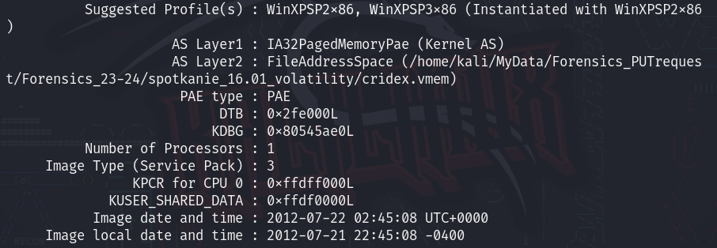

Na badanym komputerze możemy znaleźć wiele śladów pozostawionych przez osobę go użytkującą, ale najpewniej najbardziej interesujące nas informacje można znaleźć wewnątrz zrzutów pamięci (eng: *memory dump*) - czyli utworzonym obrazie pamięci RAM. Zrzuty te bardzo często są bardzo obszerne i zawierają dużo informacji, których nie można łatwo wyciągnąć, np. poprzez komendę `strings`.

W tym przypadku bardzo pomocne jest narzędzie [`Volatility`](https://volatilityfoundation.org/).

Oryginalne pliki źródłowe znajdują się w repozytoriach prowadzonych przez `Volatility Foundation`:

- [Volatility](https://github.com/volatilityfoundation/volatility)
- [Volatility3](https://github.com/volatilityfoundation/volatility3)

!!! info "Różnice między wersjami"
    Czytając o Volatility możemy zadać sobie pytanie, dlaczego istnieją **dwie wersje programu**?

    Podział pochodzi wprost z wersji Pythona, który odpowiada za uruchamianie skryptów:

    - `Volatility` (nazywane również `Volatility2`) korzysta z Pythona w wersji 2.
    - `Volatility3` korzysta z Pythona w wersji 3.
    
!!! question "Którą wersję wybrać?"
    Najnowsza stabilna i najbardziej bogata w funkcje wersja to [Volatility 2.6](https://volatilityfoundation.org/frequently-asked-questions/) (stan na 10.03.2024). Nie jest niestety już ona dalej rozwijana, pomijając pomniejsze poprawki pluginów i bug fixów.

    Oficjalnie rozwijana wersja to *Volatility3*, będąc jednocześnie najbardziej kompatybilną z nowymi wersjami systemów i programów.

    **W SKRÓCIE**

    - Dla starszych zrzutów pamięci i dla większej dostępności pluginów - [`Volatility`](https://github.com/volatilityfoundation/volatility)
    - Dla nowszych systemów i rozwoju - [`Volatility3`](https://github.com/volatilityfoundation/volatility3)

## Podstawy

Baadnie pamięci wbrew pozorom nie jest takie skomplikowane - najistotniejszą kwestią jest użycie odpowiedniego zestawu narzędzi. Dobrym podejściem jest postępowanie według schematu:

1. Komendą `strings` wyszukujemy jakichś wskazówek
2. Identyfikujemy profil obrazu (jaki OS, wersja, etc.)
    1. W `Volatility3` identyfikacja profilu jest zbędna - można natomiast otrzymać dodatkowe informacje o oryginalnym systemie
3. Analizujemy listę procesów i szukamy podejrzanych rekordów
4. Analizujemy historię commandline i listę plików - znowu szukamy podejrzanych rekordów

---

* Dodatkowe informacje o aplikacji oraz listę dostępnych pluginów można uzyskać poprzez komendę: `vol.py -h`
* Chcąc wyszukać odpowiednią nazwę pluginu przeznaczonego do konkretnej operacji, możemy użyć komendy `grep`.
    - Przykładowo, gdy nie wiemy jakiego pluginu użyć, aby wyszukać jakichś konkretnych informacji dotyczących procesów, możemy użyć takiej komendy:

    ```
    <python2> vol.py -h | grep process
    ```
    


## Profilowanie obrazu

Profilowanie jest prowadzone w `Volatility2`, by móc ustalić jaki był pierwotny system analizowanego obrazu pamięci.

W `Volatility3` jest to opcja dodatkowa, która może zwrócić dodatkowe informacje.

=== "Volatility 2"
    ```
    vol.py -f "ścieżka/do/pliku" imageinfo
    ```
    Przykład:

    

    Głównym powodem uruchamiania tej komendy jest wyciągnięcie informacji o najlepiej dopasowanym `profilu systemu`, który należy później wykorzystywać do dalszej analizy.

    W tym przypadku najbardziej prawdopodobną opcją jest ==WinXPSP2x86==.

=== "Volatility 3"
    ```
    vol.py -f "ścieżka/do/pliku" windows.info
    ```
    Przykład:

    

## Analiza procesów

Do analizy procesów możemy użyć różnego rodzaju pluginów, zależnie od poszukiwanej informacji.

=== "Volatility 2"
    ```
    vol.py -f "ścieżka/do/pliku" --profile <profil> <plugin>
    ```

    Przykładowe pluginy:

    - pslist
    - psscan
    - pstree

=== "Volatility 3"
    ```
    vol.py -f "ścieżka/do/pliku" <plugin>
    ```

    Przykładowe pluginy:

    - windows.pslist
    - windows.psscan
    - windows.pstree

## Dumpowanie danych

### Dump procesów

Dump procesów o konkretnym PID (np. pliki .exe).

`Volatility 3` dodatkowo dumpuje powiązane pliki DLL.

Używany np. do reverse engineeringu plików wykonywalnych procesów - w poszukiwaniu sygnatur malware'u bądź podobnych.

=== "Volatility 2"
    ```
    vol.py -f "ścieżka/do/pliku" --profile=<profil> procdump -p <PID> --dump-dir="ścieżka/do/zapisu"
    ```

=== "Volatility 3"
    ```
    vol.py -f "ścieżka/do/pliku" -o "ścieżka/do/zapisu" windows.dumpfiles --pid <PID>
    ```

### Dump pamięci

Dump pamięci podręcznej procesów o konkretnym PID - może przechowywać dodatkowe informacje wykorzystywane przez proces w trakcie jego działania.

=== "Volatility 2"
    ```
    vol.py -f "ścieżka/do/pliku" --profile=<profil> memdump -p <PID> --dump-dir="ścieżka/do/zapisu"
    ```

=== "Volatility 3"
    ```
    vol.py -f "ścieżka/do/pliku" -o "ścieżka/do/zapisu" windows.memmap --dump --pid <PID>
    ```

### Dump plików

Najpierw należy przeskanować listę dostępnych plików, a następnie wykorzystać informacje o `offsecie` w którym ten plik się znajduje.

1. ==Skanujemy== w poszukiwaniu plików:

=== "Volatility 2"
    ```
    vol.py -f "ścieżka/do/pliku" --profile=<profil> filescan"
    ```

=== "Volatility 3"
    ```
    vol.py -f "ścieżka/do/pliku" windows.filescan
    ```

2. ==Wyciągamy== plik o danym offsecie:

=== "Volatility 2"
    ```
    vol.py -f "ścieżka/do/pliku" --profile=<profil> dumpfiles --dump-dir="ścieżka/do/zapisu" -Q <offset>
    ```

=== "Volatility 3"
    ```
    vol.py -f "ścieżka/do/pliku" -o "ścieżka/do/zapisu" windows.dumpfiles
    ```

## Źródła

- https://ctf101.org/forensics/what-is-memory-forensics/
- https://blog.onfvp.com/post/volatility-cheatsheet/