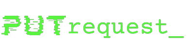

# Welcome to MkDocs

For full documentation visit [mkdocs.org](https://www.mkdocs.org).

## Commands

* `mkdocs new [dir-name]` - Create a new project.
* `mkdocs serve` - Start the live-reloading docs server.
* `mkdocs build` - Build the documentation site.
* `mkdocs -h` - Print help message and exit.

## Project layout

    mkdocs.yml    # The configuration file.
    docs/
        index.md  # The documentation homepage.
        ...       # Other markdown pages, images and other files.

---

Wikipedia koła naukowego PUTrequest_ na Politechnice Poznańskiej.

---

Na tej stronie można znaleźć spis przydatnych narzędzi oraz programów, z których korzystamy na spotkaniach poszczególnych sekcji koła.

W skład koła wchodzą sekcje:

- <h3>Analiza</h3>
- <h3>Web</h3>
- <h3>Forensics</h3>
- <h3>Crypto</h3>
- <h3>Reverse</h3>
- <h3>OSINT</h3>

<h2>Owocnego hackowania!</h2>

