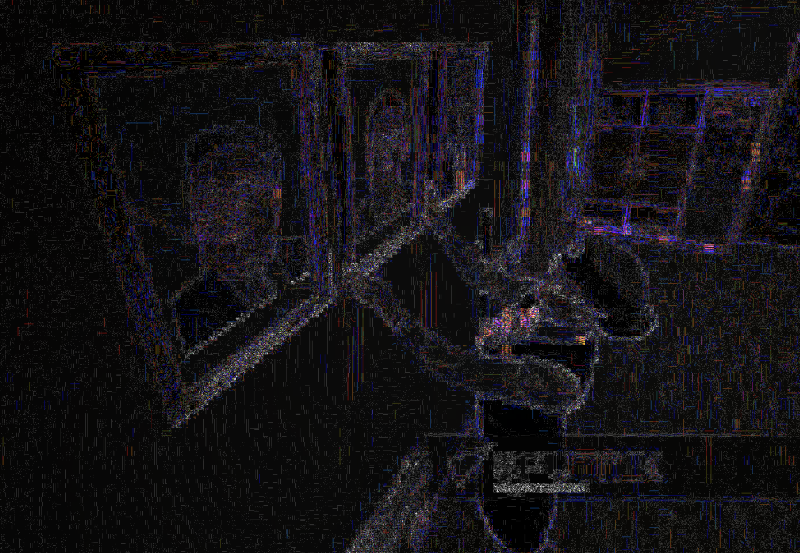
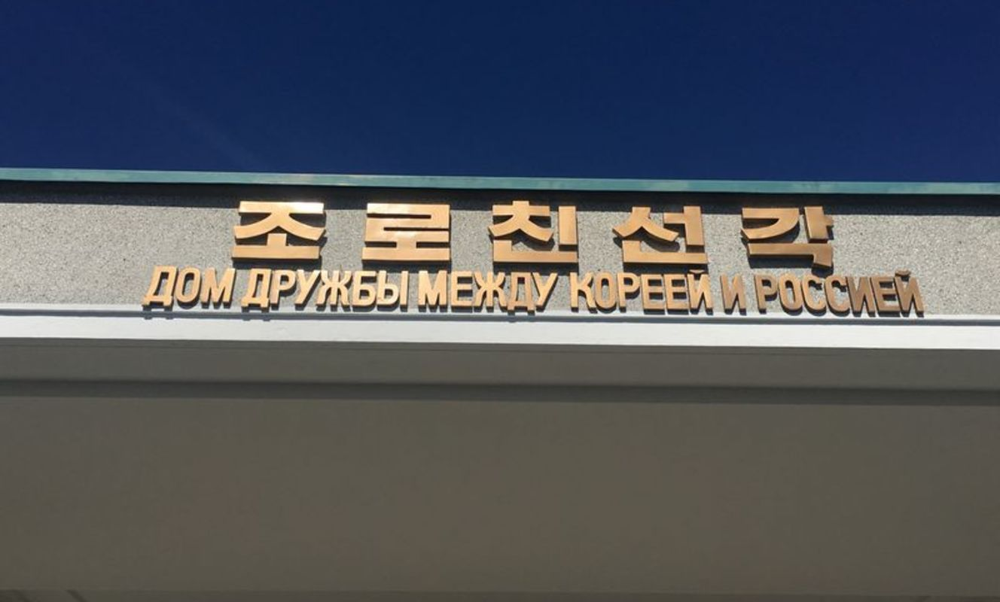
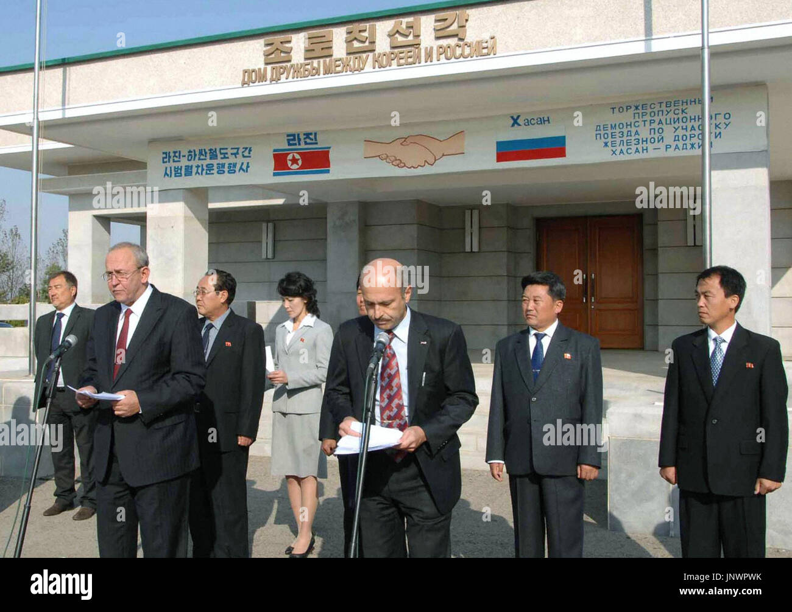

# Case Study - Dom Przyjaźni Koreańsko-Rosyjskiej

11 kwietnia 2024 na spotkaniu sekcji OSINT uczestnicy podjęli się zbadania sformułowanej wcześniej hipotezy. Na różnych mapach internetowych, między innymi Google Maps, w miejscowości Chasan w okolicy punktu styku granic Rosji, Korei Północnej i Chin znaleźć można obiekt nazwany "Korea-Russia Friendship House", symboliczny jednopiętrowy budynek wzniesiony w ramach upamiętnienia przyjacielskich relacji między dwoma krajami.
Wśród dostępnych do wglądu nielicznych zdjęć domu przyjaźni znalazło się jednak jedno, przedstawiające trzy portrety na jednej ze ścian wewnątrz budynku. Portrety przedstawiały Kim Ir Sena, Kim Dzong Ila oraz Władimira Putina.
Problemem był kontrast między portretami przywódców Korei Północnej, a portretem prezydenta Rosji. Chociaż jednym z pierwszych wytłumaczeń różnicy w wyglądzie portretów mogło być dostarczenie portretów z osobnych źródeł z różnych krajów, członkowie koła byli zgodni, że zdjęcie wyglądało nienaturalnie.
Nie minęło wiele czasu aż zaczęto teoretyzować jakoby portret Putina miał być dorobiony do zdjęcia komputerowo. Podjęta została decyzja, aby tematem zajęć było przeprowadzenie dochodzenia sprawdzającego autentyczność wrzuconego zdjęcia.

Zdjęcie obiektu dostępne na [Google Maps](https://www.google.com/maps/place/Korea-Russia+Friendship+House/@42.4166996,130.6437121,3a,75y,90t/data=!3m8!1e2!3m6!1sAF1QipP4noJhJJCtI_eJXriWrhHpcSer1Y6nLlF3IMhi!2e10!3e12!6shttps:%2F%2Flh5.googleusercontent.com%2Fp%2FAF1QipP4noJhJJCtI_eJXriWrhHpcSer1Y6nLlF3IMhi%3Dw203-h152-k-no!7i3264!8i2448!4m7!3m6!1s0x5fb594238b9c7619:0x658ac6e3ab27cba1!8m2!3d42.4166996!4d130.6437121!10e5!16s%2Fg%2F11hd5dy3ts?authuser=0&entry=ttu)

Wzbudzające podejrzenia zdjęcie portretów

## Początkowe tropy

Ze względu na charakter śledztwa nie zdecydowano się na podejmowanie szczególnych środków bezpieczeństwa w ramach OPSEC. Rozpoczęto od równoległego zbadania kilku ścieżek:

- Strony obiektu na Google Maps, umieszczonych zdjęć placówki, opinii zwiedzających oraz pozostałych zamieszczonych informacji 
- Odszukania informacji o budynku w mediach i portalach społecznościowych 
- Error Level Analysis (ELA) zdjęcia portretu celem odnalezienia artefaktów kompresji

Rezultaty przeprowadzonej przy pomocy witryny [Forensically](https://29a.ch/photo-forensics/#forensic-magnifier) analizy ELA nie wskazały na komputerową obróbkę zdjęcia. Oprócz tego znaleziona została oferta sprzedaży [portretu](https://www.wildberries.ru/catalog/173726289/detail.aspx) odpowiadającego temu na zdjęciu.

Poszukiwania informacji na temat obiektu w mediach miały posłużyć odnalezieniu większej ilości zdjęć oraz nagrań znajdujących się tam portretów. Jednak w anglojęzycznym internecie zachowało się niewiele informacji na temat domu przyjaźni, stąd spróbowano dowiedzieć się więcej przeszukując rosyjskojęzyczny i koreańskojęzyczny internet, do tego celu przełączono się na wyszukiwarkę [Yandex](https://yandex.ru). Pozwoliło to na wyszukanie [artykułu](https://www.yna.co.kr/view/AKR20230421071500009) opisującego ceremonię ponownego otwarcia budynku po remoncie, który zarządzono po pożarze budynku w listopadzie 2015 roku, natomiast zakończono w kwietniu 2016 roku.

Wszystkie multimedia udostępnione na Google Maps pochodziły z okresu po renowacji obiektu. Jako że kolejnym z tropów była strona domu na Google Maps, postanowiono przyjrzeć się autorowi zdjęcia, na którym widoczne były portrety. Aktywność użytkownika убить время została sprawdzona, jednakże trop ten okazał się być ślepym zaułkiem - jego konta nie udało się powiązać z żadnymi innymi kontami ani osobami, natomiast pozostała aktywność na Google Maps ograniczała się do zdjęcia z niezwiązanej z domem przyjaźni szkoły podstawowej.

## Nowe odkrycia i przełom

Samo Google Maps okazało się być niewystarczające, stąd informacji dalej szukano w mediach. Natrafiono na artykuł ze strony Sputnik Mediabank, w którym umieszczono kolejne zdjęcia z wnętrza domu, na których uchwycone były trzy portrety z innych perspektyw. Znacząco zwiększało to prawdopodobieństwo autentyczności oryginalnego zdjęcia, jednak uczestnicy na tym nie poprzestali. Przeprowadzona została analiza ELA kolejnych zdjęć, która również nie wykazała występowania anomalii.

Error Level Analysis

Następnie odnaleziono anglojęzyczny artykuł z przewodnika po Korei Północnej na portalu [Koryogroup](https://koryogroup.com/travel-guide/russia-dprk-friendship-house-north-korea-travel-guide), który opisywał dom przyjaźni między Rosją, a KRLD będący budynkiem pełniącym rolę niewielkiej wystawy zdjęć ukazujących relacje między dwoma państwami. Uwagę sekcji OSINT przykuło jednak zdjęcie szyldu, który zupełnie nie pasował do konstrukcji w Chasaniu. Konsternacji dodawała informacja w przewodniku, jakoby w budynku zabronione było robienie zdjęć, podczas gdy uczestnicy mieli już kilka zdjęć z wnętrza ośrodka. Wreszcie, w tekście padła lokalizacja budynku na terenie Korei Północnej, na obrzeżach miasta Tumangang. Sugerowało to, że po stronie koreańskiej wybudowany został osobny budynek pełniący tę samą funkcję, co jego odpowiednik w Rosji.

Szyld kolejnego domu przyjaźni

Uczestnicy postanowili od tego momentu rozdzielić poszukiwania na dwie równoległe części:

- weryfikację autentyczności zdjęcia portretów przywódców państw w rosyjskim domie przyjaźni
- znalezienie więcej informacji dotyczących koreańskiego domu przyjaźni, w szczególności jego lokalizacji

Owocnym dla pierwszego z celów okazało się być zastosowanie w wyszukiwarce wyszukiwania obrazem, którym potraktowano wszystkie dotyczące sprawy zdjęcia. Doprowadziło ono uczestników do [materiału](https://www.youtube.com/watch?v=S1ch98bXFzw) na YouTube autorstwa użytkownika Руслан Усачев, w którym udokumentował on swoją podróż w okolice granicy północnokoreańsko-rosyjskiej. Na nagraniu znajdowały się ujęcia wewnątrz domu przyjaźni, na których nie tylko znajdował się badany zestaw portretów, ale i z których pochodziło oryginalne zdjęcie, będące jedną z klatek filmu. Szerszy kontekst oryginału utwierdził uczestników, że w domie przyjaźni rosyjsko-koreańskiej w Chasaniu faktycznie powieszony jest portret Władimira Putina.

## Nowa odnoga śledztwa

W przypadku domu po stronie koreańskiej, wyszukiwanie wsteczne obrazu szyldu poskutkowało odnalezieniem zdjęcia wejścia budynku w trakcie uroczystości 13 października 2011 roku, z informacją o lokalizacji niedaleko stacji kolejowej Tumangang. 

Zdjęcie stockowe

Dalsze googlowanie obiektu na podstawie znalezionych informacji, tekstu odczytanego ze zdjęć oraz samych fotografii przyniosło kolejne [zdjęcie](https://www.picuki.com/media/3330660614938452003) umieszczone na Instagramie oraz trop w postaci japońskojęzycznego bloga podróżniczego [Finewingz](https://finewingz.com/china-northkorea-russia-travel-7/), gdzie autor zdał relację z podróży po Korei Północnej. Oprócz jeszcze jednego zdjęcia frontu budynku umieszczona była również fotografia tabliczki na murach ośrodka, upamiętniającej wizytę Kim Dzong Ila 24 sierpnia 2002 roku w drodze powrotnej z Rosji. 

Tabliczka pamiątkowa

Kolejne wyszukiwanie wsteczne znalezionych obrazów doprowadziło uczestników do fotorelacji z rozpoczęcia renowacji drogi kolejowej. Nie był to koniec znalezisk na blogu, okazało się bowiem, że autor umieścił na stronie [link](https://www.youtube.com/watch?v=pfm5C8xSyEA) do swojego materiału z podróży kolejowej przez granicę koreańsko-rosyjską, w szczególności przez most przyjaźni zbudowany na rzece Tuman. Kolejne wyszukiwanie wsteczne znalezionych obrazów doprowadziło uczestników do fotorelacji z rozpoczęcia renowacji owej drogi kolejowej na [stronie](https://mid.ru/ru/press_service/photo/meropriyatiya_v_zagran_uchrezdeniyah/1704289/) MSZ Rosji.

Film z przejazdu przez most pociągiem przedstawiał widok na wschodnią stronę kolei, która, zgodnie ze zdjęciami satelitarnymi na Google Maps, jest praktycznie niezabudowana. Pozwoliło to zawęzić lokalizację domku do terenu po zachodniej stronie torów kolejowych po koreańskiej stronie granicy, w mieście Tumangang.

Uczestnicy postanowili więc skupić się na analizowaniu zdjęć satelitarnych i zlokalizowaniu budynku, który wymiarami, otoczeniem i wyglądem z lotu ptaka możliwie najlepiej pasował do domu przyjaźni, którego zdjęcia odnaleziono wcześniej. Za najlepsze dopasowanie uznano budynek oznaczony na Google Maps jako przejście graniczne "[Tumangang Border Control](https://www.google.com/maps/place/Tumangang+Border+Control/@42.4133226,130.625552,2520m/data=!3m1!1e3!4m6!3m5!1s0x5fb5941e5b708d45:0x12ce8fa739e86325!8m2!3d42.4140233!4d130.6302202!16s%2Fg%2F11b6mp63dz?entry=ttu)". Ośrodek ten nie znajdował się jednak bezpośrednio przy granicy, a kilkaset metrów od niej, w lokalizacji lekko na uboczu. Miejsce to prezentowało jednak kolejną nieścisłość: 

Powyższe zdjęcie zostało wrzucone przez internautów jako ilustracja miejsca Tumangang Border Control na Google Maps. Sekcja OSINT dostrzegła, że zdjęcie to nie pokrywa się z dachem budynku, który został uchwycony na wcześniejszych zdjęciach, natomiast okolica widoczna na zdjęciu nie pokrywa się z tym, co można dostrzec na mapach, nie wspominając o uwzględnieniu flagi Chin, kraju jak dotąd nieobecnego w materiałach dotyczących ośrodka. Aby to wytłumaczyć, zdecydowano się przeglądać dalej teren wokół granicy. Wreszcie, udało się zlokalizować miejsce, z którego najprawdopodobniej zrobiono fotografię ilustrującą Tumangang Border Control, nie był to jednak budynek na terenie ani Korei Północnej, ani Rosji, lecz Chińskiej Republiki Ludowej. Uczestnicy doszli do wniosku, że zdjęcie to zostało zrobione z wieży widokowej na terenie przygranicznego parku krajobrazowego [Fangchuan](https://www.google.com/maps/place/Fangchuan+National+Scenic+Area/@42.436046,130.58299,3a,75y,90t/data=!3m8!1e2!3m6!1sAF1QipNWNkj482fhtEoQMwwXtF08g7IkgE107HWqrGNg!2e10!3e12!6shttps:%2F%2Flh5.googleusercontent.com%2Fp%2FAF1QipNWNkj482fhtEoQMwwXtF08g7IkgE107HWqrGNg%3Dw203-h152-k-no!7i1706!8i1279!4m7!3m6!1s0x5fb597206e91d9bd:0xa702aeaace7abd18!8m2!3d42.436046!4d130.58299!10e5!16s%2Fg%2F1wc47tcg?entry=ttu), ok. 4 kilometry na północny zachód od mostu przyjaźni widocznego na zdjęciu. Tajemnicą pozostaje powód wrzucenia tego zdjęcia do niewłaściwego obiektu w innym państwie, jednakże tego typu nieścisłości są w serwisie Google Maps powszechne, z racji możliwości umieszczania zdjęć z danej lokalizacji przez dowolnego użytkownika.

## Konkluzja

Graf śledztwa utworzony w programie Maltego

Na zakończenie śledztwa postanowiono podsumować dotychczasowe odkrycia i wydanie werdyktu w sprawie postawionej hipotezy dotyczącej sfałszowania portretu na zdjęciu z domu przyjaźni, jak i istnienia dwóch osobnych domów. W celu dojścia do konsensusu uczestnicy użyli metody [dot voting](https://en.wikipedia.org/wiki/Dot-voting) - każdy otrzymał kolorowe kartki symbolizujące zgadzanie się z hipotezą, wątpliwości co do hipotezy i niezgadzanie się z hipotezą. Wyniki prezentowały się następująco:

| Hipoteza | + | ? | - |
| -------- | --| - | - |
| Portret jest autentyczny i nie został dodany komputerowo    | 10 | 0 | 0 |
| Istnieją dwa domy przyjaźni rosyjsko-koreańskiej:   [Korea-Russia Friendship House](https://www.google.com/maps/place/Korea-Russia+Friendship+House/@42.4186591,130.6291215,2059m/data=!3m1!1e3!4m6!3m5!1s0x5fb594238b9c7619:0x658ac6e3ab27cba1!8m2!3d42.4166996!4d130.6437121!16s%2Fg%2F11hd5dy3ts?entry=ttu) i [Tumangang Border Control](https://www.google.com/maps/place/Tumangang+Border+Control/@42.4186591,130.6291215,2059m/data=!3m1!1e3!4m6!3m5!1s0x5fb5941e5b708d45:0x12ce8fa739e86325!8m2!3d42.4140233!4d130.6302202!16s%2Fg%2F11b6mp63dz?entry=ttu) | 4 | 6 | 0 |

## Metryka zmian
| Wersja       | Data       | Osoba             | Opis zmian                                      |
| ------------ | ---------- | ----------------- | ----------------------------------------------- |
| v1.0.0       | 10.05.2024 | Jakub Szybura     | Wersja bazowa                                   |
