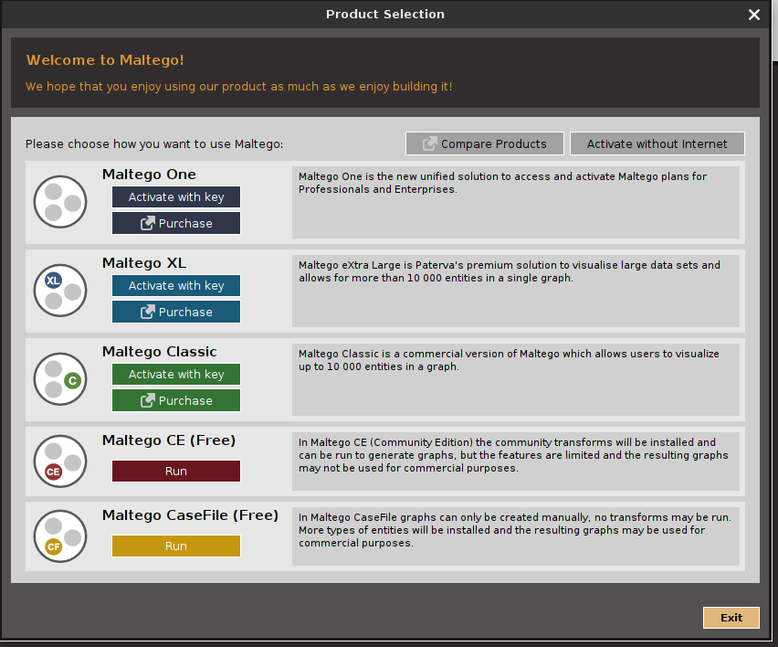
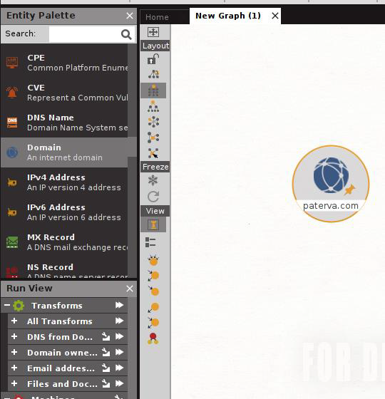
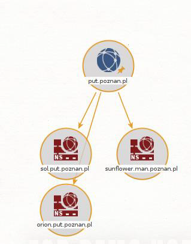
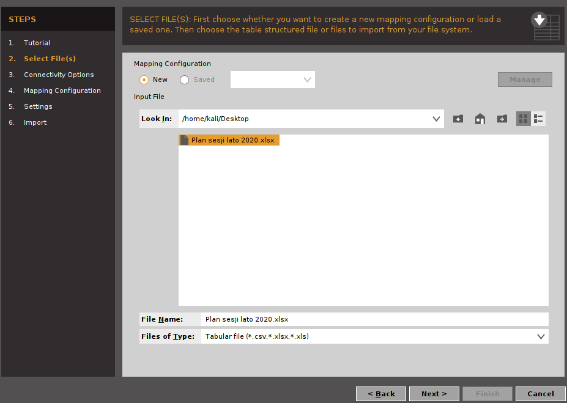
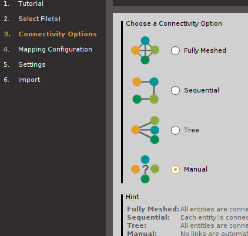

Maltego to oprogramowanie wykorzystywane do wywiadu i kryminalistyki typu open source, opracowane przez Paterva z Pretorii w RPA. Narzędzie to wykorzystywane jest do obrazowania selektorów oraz do transformacji automatycznych.
Maltego można pobrać [tutaj](https://www.maltego.com/downloads/).
Przy pierwszym uruchomieniu konieczne będzie wygenerowanie licencji. Wybierz Maltego CE. Zaakceptuj warunki licencyjne i zaloguj się na konto. Maltego pobierze niezbędne informacje. Postępuj zgodnie z instrukcjami. W Privacy Mode wybierz opcję Normal.



W prawym górnym roku należy wybrać opcję *New graph*.


## Interfejs


1. Predefiniowane selektory, które można umieszczać na grafie na zasadzie drag&drop.
2. Widok transformacji, które można uruchomić na aktualnie zaznaczonym selektorze.
Transforms to pojedyncze transformacje automatyczne, zaś Machines to grupy
transformacji automatycznych.
3. Konsola pokazująca historię transformacji automatycznych.
4. Szczegóły aktualnie zaznaczonego selektora.
5. Relacje zaznaczonego selektora z innymi selektorami.
6. Widok całego grafu.
7. Opcje grafu m.in. zbiorowe zaznaczanie elementów, ograniczanie ich ilości oraz
przełączanie między wybieraniem selektorów i związków.
8. Opcje wyglądu grafu m.in. zmiana ułożenia selektorów, zamrożenie ich oraz
wyświetlanie w oparciu o określone właściwości.

## Transformacje automatyczne
Maltego pozwala automatyzować pracę poprzez wykonywanie automatycznych transformacji, jednak ich wyniki należy traktować z ograniczonym zaufaniem. Dodatkowo transformacje mogą być częścią tzw. Maltego Machines, które stanowią swego rodzaju makra wywołujące określony zbiór transformacji. Dodatkowo Maltego można zintegrować z innymi serwisami oraz skryptami poprzez API lub XML.
Przeciągnij na graf selektor Domain z grupy Infrastructure. 



Następnie kliknij dwukrotnie, aby otworzyć okno właściwości. Wprowadź adres domenowy np. put.poznan.pl. 


Klikając prawym przyciskiem myszy na selektor otworzymy menu transformacji. Przycisk + pozwala rozwinąć listę transformacji z danej grupy. Strzałka po prawej uruchamia daną transformację lub grupę transformacji. Cofnięcie do poprzedniej listy umożliwia przycisk po lewej stronie menu. 


Wybierz z listy DNS from Domain > TO DNS Name – NS. Spowoduje to uruchomienie transformacji, która pozyska z systemu DNS dane o serwerach NS powiązanych z domeną.



## Import danych
Maltego pozwala automatycznie pobierać dane z ustrukturyzowanych plików takich jak XML, XLS, JSON itp. oraz przetwarzać je na konkretne powiązane ze sobą selektory. Jako przykład wykorzystane plik Excela z planem sesji egzaminacyjnej. Przejdź do zakładki Import|Eksport i wybierz opcję Import 3rd party table. 


Następnie wybierz plik do zaimportowania. Stwórz nową konfigurację mapowania. 



W dalszym etapie wybierz sposób budowania połączeń. W naszym przypadku posłużymy się trybem niestandardowym Manual. 



Zmapuj tylko kolumny PRZEDMIOT, EGZAMINUJĄCY, I TERMIN DATA, II TERMIN DATA. Przedmiot ustaw jako typ Phrase, egzaminującego jako Person, daty egzaminów jako DateTime. Następnie ustaw powiązania tak jak poniżej. Dalsze ustawienia pozostaw bez zmian i wyeksportuj dane do nowego grafu.


W konsekwencji otrzymujemy graf pokazujący prowadzących wraz z przedmiotami i terminami egzaminów, które prowadzili w sesji.


W zależności od zaimportowanych kolumn oraz rodzajów połączeń można uzyskać różne rodzaje informacji. Dodatkowo można manipulować wyglądem grafu bez utraty danych. Np. wybierając z listy View opcję Ball size by links (outgoing) możemy zobrazować, który z
prowadzących prowadzi najwięcej egzaminów.


## Pluginy

Maltego posiada możliwość rozbudowy poprzez różnego rodzaju wtyczki, które można instalować ze strony startowej. Na samej górze dostępne są opcje filtrowania. Wybraną wtyczkę instalujemy poprzez wybranie opcji *INSTALL*.


Trzeba pamiętać, że niekażda wtyczka jest darmowa; niektóre zaś mogą wymagać wprowadzenia klucza API. Z przydatnych wtyczek warto jest polecić:

* Standard Transforms CE - domyślny zestaw transformacji w wersji Community.
* CaseFile Entitties - zestaw selektorów z wersji Maltego CaseFile.
* IPinfo - wtyczka zbierająca dane nt. adresów IP.
* Have I been pwned? - wtyczka zapewniająca integrację z serwisem [http://haveibeenpwned.com](Have I been pwned) sprawdzająca obecność adresów email w wyciekach danych.
* Shodan - integruje Maltego z [https://shodan.io](Shodan.io). **Wymaga klucza API**.
* Social Links CE - darmowa wersja wtyczki do analizy mediów społecznościowych.
* Wayback Machine - wtyczka wyszukująca archiwalne wersje stron WWW z [https://archive.org](Archive.org).
* WHOIS XML API - wtyczka zapewniająca możliwość odpytywania niektórych baz WHOIS.

## Własne transformacje

Maltego pozwala uruchamiać własne skrypty. Należy je uprzednio dodać przez *Transform Manager*, który znajduje się w zakładce *Transforms*. Konieczne jest dodanie komendy, która spowoduje wywołanie programu.


W celu budowania własnych transformacji warto jest skorzystać z biblitoki Pythona [Maltego TRX](https://docs.maltego.com/support/solutions/articles/15000024277-trx-transform-library-guide). Przykładowy kod przekształcający nazwę domenową na adres IPv4 wygląda następująco:

``` py title="dnstoip.py"
import socket

from extensions import registry
from maltego_trx.entities import IPAddress
from maltego_trx.maltego import UIM_TYPES, MaltegoMsg, MaltegoTransform
from maltego_trx.transform import DiscoverableTransform


@registry.register_transform(display_name="DNS to IP", input_entity="maltego.DNSName",
                             description='Receive DNS name from the Client, and resolve to IP address.',
                             output_entities=["maltego.IPv4Address"])
class DNSToIP(DiscoverableTransform):

    @classmethod
    def create_entities(cls, request: MaltegoMsg, response: MaltegoTransform):
        dns_name = request.Value

        try:
            ip_address = socket.gethostbyname(dns_name)
            response.addEntity(IPAddress, ip_address)
        except socket.error as e:
            response.addUIMessage(f"Error: {e}", UIM_TYPES["partial"])

        # Write the slider value as a UI message - just for fun
        response.addUIMessage(f"Slider value is at: {request.Slider}")
```

Biblioteka ta dodatkowo pozwala wyeksportować transformacje do pliku *.mtz*, który można bezpośrednio zaimportować do Maltego.

## Metryka zmian
| Wersja       | Data       | Osoba             | Opis zmian                                      |
| ------------ | ---------- | ----------------- | ----------------------------------------------- |
| v1.0.0       | 08.03.2024 | Grzegorz Jaskuła  | Wersja bazowa                                   |
| v1.0.0a      | 09.03.2024 | Grzegorz Jaskuła  | Pliki graficzne przeniesione do folderu /assets |
