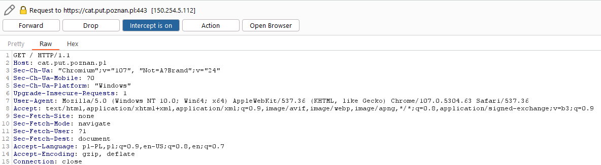

# OPSEC - Operation Security

## Co to OPSEC?

OPSEC odnosi się do procesu identyfikowania i ochrony informacji, które mogłyby zostać wykorzystane przez przeciwników do przeprowadzenia działania przeciwko danemu podmiotowi. Celem OPSEC jest utrzymanie w tajemnicy kluczowych informacji, które mogą zaszkodzić organizacji, jeśli wpadną w niepowołane ręce.

OPSEC możemy opisać pewnym cyklem składającym się z pięciu głównych kroków:

1. **Identyfikacja krytycznych informacji**: Pierwszym krokiem jest ustalenie, jakie informacje, gdyby zostały odkryte, mogłyby być szkodliwe dla organizacji lub operacji.

2. **Analiza zagrożeń**: Następnie ocenia się potencjalnych przeciwników lub zagrożenia, aby zrozumieć, kto może być zainteresowany zdobyciem tych informacji i jak mogliby to zrobić.

3. **Analiza luk**: Określa się, w jaki sposób krytyczne informacje mogą być narażone na ryzyko wycieku lub odkrycia przez nieuprawnione osoby.

4. **Ocena ryzyka**: Na podstawie analizy zagrożeń i luk, ocenia się ryzyko związane z wyciekiem informacji, biorąc pod uwagę prawdopodobieństwo i potencjalne konsekwencje.

5. **Zastosowanie środków zaradczych**: Wdraża się odpowiednie środki, mające na celu ograniczenie dostępu do krytycznych informacji i zminimalizowanie ryzyka ich wycieku. Może to obejmować zarówno fizyczne, jak i cyfrowe środki ochrony.

Aby zachować odpowiednie bezpieczeństwo danych podczas prowadzenia śledztwa, możemy kultywować poniższe metody, które przedstawione zostały w postaci "góry lodowej". Im wcześniej wymieniona jest metoda - tym bardziej powinna być traktowana jako oczywista.

## Góra lodowa OPSECu

### Warstwa wierzchnia - Podstawowe metody

#### Zaklejanie kamery

Zaklejanie kamery to podstawowa forma zapewnienia sobie bezpieczeństwa w sieci. Dzięki temu prostemu trikowi nie będziesz musiał(a) martwić się scamerami. Również twoja tożsamość (wygląd) nie będzie wykradziona przez przypadkowe włączenie kamery.

#### Popularny system operacyjny (np. Windows 10)

Używanie popularnego systemu operacyjnego i przeglądarki pozwala "wtopić się w tłum". Wysyłając żądania do serwerów, przeglądarka wysyła również informacje o używanym systemie operacyjnym, przeglądarce i ich wersjach.

Przykładowe zapytanie do serwera (Zwróć uwagę na User-Agent):

Serwery mogą przechowywać te dane w celach m.in. statystycznych, ale też mogą je wykorzystać by odkryć tożsamość osoby przeprowadzającej śledztwo OSINT-owe.

Korzystając z mało popularnych przeglądarek i systemów operacyjnych, zawężasz grono potencjalnych osób.

[Strona do sprawdzenia swojego "fingerprint" - jak bardzo przypominasz przeciętnego użytkownika.](https://amiunique.org/fingerprint)

#### Przechowywanie danych na dysku lokalnym

Przechowywanie danych figuranta na online dysku dostępnym dla każdego użytkownika internetu może być złym pomysłem. Dane najlepiej przechowywać lokalnie i zaszyfrowane.

Figurant nie powinien wiedzieć, że jest śledzony.

#### Korzystanie z VPN

Dzięki VPN możesz ukryć swój publiczny adres IP i np. podszywać się pod obywatela innego kraju.

#### Korzystanie z kont operacyjnych

Dla każdego śledztwa OSINT-owego powinieneś(aś) używać *kont operacyjnych*, potocznie zwanych *fake kontami*. Dzięki temu możesz obserwować figuranta 

#### Korzystanie z tymczasowego adresu e-mail

Korzystając z tymczasowego adresu e-mail możesz ukryć swoją prawdziwą tożsamość. Niektóre serwisy pocztowe zbierają dużo danych. Dzięki temu możesz się przed tym obronić, dodatkowo nie musisz pamiętać o usuwaniu poszlak, gdyż zostaną automatycznie usunięte.

#### Serwer Proxy

Serwer proxy jest używany do zwiększenia anonimiwości użytkownika - działa jako pośrednik między użytkownikiem a internetem, przesyła ruch internetowy przez ten serwer.

W ten sposób można ukryć rzeczywisty adres IP użytkownik. Serwery też mogą pomóc omijać blokady regionalne.

### Warstwa pod wodą - Zaawansowane metody

#### Profil na mediach społecznościowy z zdjęciem AI

Kradzież zdjęć prawdziwych osób może zakończyć się niemiłymi konsekwencjami. Używając zdjęcia AI nie kradniesz czyjegoś wizerunku.
Największy problem ze zdjęciami AI jest taki, że niektóre serwisy społecznościowe to wykrywają. Biorąc zdjęcie np. ze strony [thispersondoesnotexist.com](https://thispersondoesnotexist.com/) należy je odpowiednio wykadrować, by ominąć filtry (ta strona zawsze daje oczy i usta w tej samej pozycji).

#### Różne serwisy - różne loginy

Należy mieć różne loginy (i hasła!) do różnych serwisów. W ten sposób trudniej połączyć nasze różne konta operacyjne ze sobą.

#### Sterylne środowisko pracy - nowy case, nowa maszyna wirtualna

Przy każdym śledztwie narażamy się na wykrycie, a na naszym komputerze mogą zostać różne pliki, które mogłyby wskazać naszą prawdziwą tożsamość.
Dzięki użyciu maszyny wirtualnej (najlepiej z popularnym systemem operacyjnym), możemy uniknąć wycieku naszych danych.
Po skończonym śledztwie należy usunąć maszynę, by pozbyć się dowodów mogących nas obciążyć - i dodatkowo przy wykryciu nie będziemmy ryzykować, że nasze poprzednie śledztwa zostaną z nami powiązane.

#### Łączenie się przez publiczne Wi-Fi

Używanie publicznego adresu IP ma dwa cele:
- Zatajenie prawdziwego adresu IP (które dużo zdradza, w tym np. operatora)
- Celowe wprowadzenie w błąd (np. specjalne zalogowanie się z innego miasta niż w którym mieszka osoba prowadząca śledztwo OSINTowe).

#### Korzystanie z Tor

Spójrz [VPN na PUTwiki](https://putrequest.github.io/PUTwiki/osint/osint_wiki/#aczenie-z-siecia)

### Warstwa najgłębsza - Najbardziej zaawansowane metody

#### Nowy case - nowe urządzenie fizyczne

Na urządzeniu fizycznym mogą pozostać artefakty - logi, pliki... Warto użyć nowego telefonu by się zabezpieczyć. W tym celu można zaopatrzyć się w jakieś tanie urządzenie, np. z lombardu.

#### Rejestrowanie numerów na zagraniczne karty SIM

W Polsce istnieje coś takiego jak *ustawa o działaniach antyterrorystycznych*.

Link do dokładnego opisu [Strona rządowa](https://www.gov.pl/web/mswia/ustawa-o-dzialaniach-antyterrorystycznych).

Artykuł z jakiejś [kancelarii adwokackiej](https://www.adwokat-cholub.pl/aktualnosci/79-obowiazek-rejestracji-telefonu-na-karte-pre-paid-ustawa-antyterrorystyczna-weszla-w-zycie.html).

Przez tę ustawę, rejestrując numer telefonu, trzeba podać swoje dane - imię i nazwisko.

W innych krajach nie ma tego obowiązku - stąd można w bezpieczny sposób, nie ryzykując ujawnienia tożsamości analityka, zakładać różne konta.

#### Rejestrowanie numerów "na słupa"

Nie jest to legalne, ani moralne, ale może pomóc zataić dane osoby, która zakłada jakieś konto, które wymaga potwierdzenie numerem telefonu.

#### Własna domena mailowa

Porzucone domeny mailowe, które można odkupić to strzał w dziesiątkę. Różne algorytmy mogą znaleźć je w bazach z wyciekami, przez co są uznane za wiarygodne.

#### Celowy false positive

Metoda chętnie stosowana przez dziennikarzy - np. specjalne udawanie osoby o konkretnych poglądach, by dostać dostęp do ogólnie niedostępnych miejsc.

| Wersja       | Data       | Osoba             | Opis zmian                         |
| ------------ | ---------- | ----------------- | ---------------------------------- |
| v1.0.0       | 10.04.2024 | Zuzanna Ławniczak | OPSEC                              |

